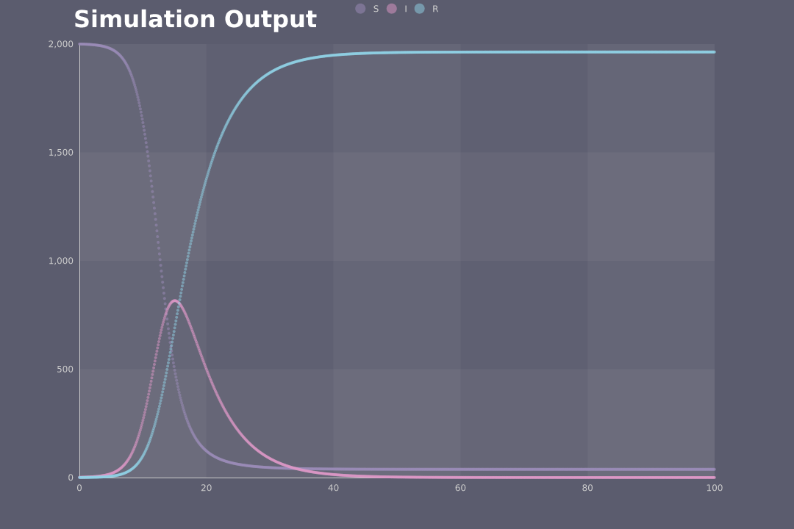

# 感染症流行のシミュレーション

- $S$: 感受性人口 (susceptible)
- $I$: 感染人口 (infectious)
- $R$: 隔離人口 (removed)

感染する可能性がある人口が多いほど感染者数の増加も多い  
$c$は比例定数  
$I(t + \Delta t) - I(t) = cS(t)I(t)\Delta t$

感染人口が増えるほど感受性人口は減少する  
$S(t + \Delta t) - S(t) = -cS(t)I(t)\Delta t$

感染者は全員回復して免疫を獲得する  
$g$は比例定数  
$R(t + \Delta t) - R(t) = gI(t)\Delta t$  
回復した人数分だけ感染人口が減少するので  
$I(t + \Delta t) - I(t) = cS(t)I(t)\Delta t - gI(t)\Delta t$

ある感染者について1日に平均4回接触があるとして，1/10000の確率で感染すると仮定すると  
$c = 4 \times 0.0001 = 0.0004$  
1日に20%が回復すると仮定して  
$g = 0.2$

